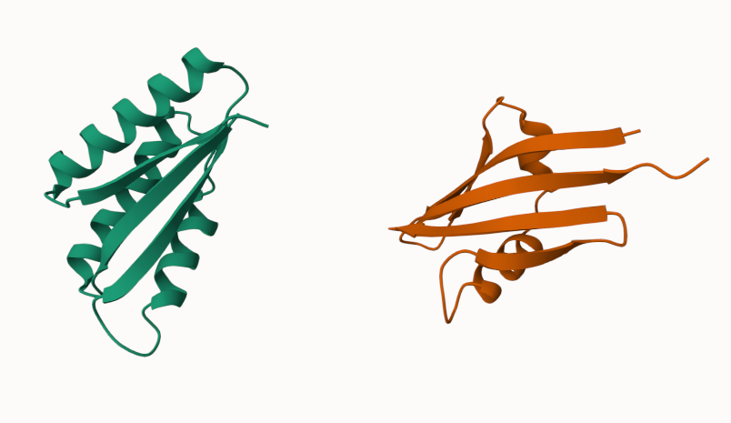

# RFdiffusion Guide for Lin Lab

This is the main utility for users to commit protein design. There are a number of modes to choose from for specific tasks.

Source: https://github.com/RosettaCommons/RFdiffusion/

- [RFdiffusion Guide for Lin Lab](#rfdiffusion-guide-for-lin-lab)
  - [Usage](#usage)
    - [Basic Usage](#basic-usage)
    - [Case1: Unconditional](#case1-unconditional)
    - [Case2: Scaffolding](#case2-scaffolding)
      - [When the active sites/motif is very small](#when-the-active-sitesmotif-is-very-small)
      - [Hide sequence for inpainting](#hide-sequence-for-inpainting)
    - [Case3: Partial diffusion](#case3-partial-diffusion)
      - [keep parts of the seq fixed](#keep-parts-of-the-seq-fixed)
    - [Case4: Binder design](#case4-binder-design)
      - [Suggestions](#suggestions)
    - [Case5: Fold conditioning](#case5-fold-conditioning)
    - [Case6: Symmetric oligomers](#case6-symmetric-oligomers)
    - [Case7: Auxiliary potential](#case7-auxiliary-potential)
    - [Case8: Symmetric motif scalffding](#case8-symmetric-motif-scalffding)

## Usage

Create conda environment SE3nv if not any:

```bash
conda env create -f /opt/RFdiffusion/env/SE3nv.yml
conda update --all -c pytorch   # to ensure that the cuda can be detectedconda activate SE3nv
cd /opt/RFdiffusion/env/SE3Transformer
pip install --no-cache-dir -r requirements.txt
py=`which python`
sudo $py setup.py install       # in case you don't have the write permission
cd ../..
py=`which pip`
sudo $py install -e .           # in case you don't have the write permission
```
This first installs the transformer, then installs the repo as editable, so DO NOT edit it.

Activate before use:

```bash
conda activate SE3nv
```

### Basic Usage

The only way to run RFdiffusion is through `script/run_inference.py`. All parameters are managed by config files.

```bash
# running the basic config settings: config/base.yaml
python $HOME/RFdiffusion/script/run_inference.py
run_inference.py    # when the script has been added to the PATH

# running custom config
run_inference.py --config-name symmetry
# there is a symmetry.yaml under config/, it will look for yaml files under that folder, or you provide a full path to your custom ones.
```

### Case1: Unconditional

Generate a protein structure w/o any condition.

```bash
run_inference.py 'contigmap.contigs=[150-150]' inference.output_prefix=demo1/test inference.num_designs=2
```
Note: this uses base.yaml as default setting while specifying some of them.
For example, `contigmap.contigs` is an entry under `contigmap`, which by default is null.
It is also quoted to prevent the seperation of its content.

Explanation:
>First, there is no input and this protein's length is designated as 150aa using the above specifications. It will give 10 samples saved in `test_outptus/test`.

For each design, it takes ~2min to complete. Here is an example output


### Case2: Scaffolding

Make a Scaffold for a particular protein motif with some function.

```bash
run_inference.py inference.output_prefix=demo2/test inference.input_pdb=$HOME/RFdiffusion/examples/input_pdbs/5TPN.pdb 'contigmap.contigs=[10-40/A163-181/10-40]' inference.num_designs=2
```

Need to specify:

* the motif
* how to connect the scaffold with the motif
* length of the scaffold

Using contigs to handle the input:

* input a pdb: `inference.input_pdb=<your path>`
* in `contigmap`:
  * using a letter prefix + number range to indicate the motif (`A10-25`)
  * number range w/o prefix is to be built
  * chain breaks: `/0`

Example: `contigmap.contigs=[5-15/A10-25/30-40/0 B1-100]`

> 2 chains, A & B.  
> In chain A, generate scaffolds of 5~15 aa in N-term, 30~40 aa in C-term, and use 10~25 from the input pdb as the motif. Generate another scaffolds of 100 aa.

`contigmap.length=55-55` to specify the total length.

takes ~1min each.



#### When the active sites/motif is very small

The model may not hold the sites fixed, therefore a fine-tuned model is recommended for this task, by invoking `inference.ckpt_override_path=$HOME/RFdiffusion/models/ActiveSite_ckpt.pt`.

#### Hide sequence for inpainting

`'contigmap.inpaint_seq=[A1/A30-40]'`

### Case3: Partial diffusion

By specifying a differnt diffusion timestamp `diffuser.partial_T` (default 50, the bigger the more noise), change the degree of diversity of the result protein.

```bash
run_inference.py inference.output_prefix=demo3/test inference.input_pdb=$HOME/RFdiffusion/examples/input_pdbs/2KL8.pdb 'contigmap.contigs=[79-79]' inference.num_designs=3 diffuser.partial_T=10
```

Note: the length of the contig chain must be the same as the corresponding input chain to let the program know the input should be referred to.

takes ~3s each.


#### keep parts of the seq fixed
`'congtigmap.provide_seq=[100-119]'`, provide a sequence to fix.

### Case4: Binder design

```bash
run_inference.py inference.output_prefix=demo4/test inference.input_pdb=$HOME/RFdiffusion/examples/input_pdbs/insulin_target.pdb 'contigmap.contigs=[A1-150/0 70-100]' 'ppi.hotspot_res=[A59,A83,A91]' inference.num_designs=3 denoiser.noise_scale_ca=0 denoiser.noise_scale_frame=0
```

Direct call of scaffolding (1 chain from input the other bind onto it) can be used but very slow for large targets. Instead, use hotspots by `'ppi.hotspot_res=[A30,A33,A34]'`

>By default, helical binders are mostly generated, but we can try the `beta` model to get more diverse binders.

#### Suggestions

* target selection: >~3 hydrophobic residues, no glycan
* truncate the target protein as the runtime scales O(N^2)
* hotspot selection: 10A Cbeta distance of the binder, 3-6 is recommended, as the model would make more contacts than specified.
* filtering: pae_interaction < 10 are worthless

takes ~4min each


### Case5: Fold conditioning

Generating binder design / monomer only based on particular topologies, by providing secondary structure and block adjacency info.

```bash
run_inference.py scaffoldguided.target_path=$HOME/RFdiffusion/examples/input_pdbs/insulin_target.pdb inference.output_prefix=demo5/test scaffoldguided.scaffoldguided=True 'ppi.hotspot_res=[A59,A83,A91]' scaffoldguided.target_pdb=True scaffoldguided.target_ss=$HOME/RFdiffusion/examples/target_folds/insulin_target_ss.pt scaffoldguided.target_adj=$HOME/RFdiffusion/examples/target_folds/insulin_target_adj.pt scaffoldguided.scaffold_dir=$HOME/RFdiffusion/examples/ppi_scaffolds/ inference.num_designs=3 denoiser.noise_scale_ca=0 denoiser.noise_scale_frame=0
```

* First, generate the conditioning structure from pdb, using `helper_scripts/make_secstruc_adj.py`. This will give pairs of `_ss.pt` (secondary structure) and `_adj.pt` (adjacency) as toplogical conditions.
* Then run the inference with the generated topologies. You'll see there's nothing as contigs.
* In this example, topology of the target protein can be specified separately, using `targets_ss`, `target_adj`, `target_path` and `target_pdb`. The topology might not be necessary when there is original pdb.


* When the pool of structure is big, `scaffold_list` to select some of the topology files. Below shows the effect of the increased length.
* When the pool of structure is mall, `mask_loops=True` and `sampled_insertion`, `sampled_N`, `sample_C` can extrapolate the sequence and adding extra diversity.


* inpaint while specifying secondary structure: `'contigmap.contigs=[70-100/0 B165-178]' 'contigmap.inpaint_str=[B165-178]' scaffoldguided.scaffoldguided=True 'contigmap.inpaint_str_strand=[B165-178]'`. Means the binding site will be masked but the structure is strand.

takes ~3min each.

### Case6: Symmetric oligomers

Symmetrising the noise at T and symmetrising the input at T.

```bash
run_inference.py --config-name=symmetry inference.symmetry=C6 inference.num_designs=2 inference.output_prefix=demo6/test 'contigmap.contigs=[360-360]'
```

requirements:
* config: symmetry.yml
* contigs length must be divisible by n chains.
* symmetry in cyclic, dinetral, tertrahedral.


### Case7: Auxiliary potential

The generation of symmetric oligomers use guiding potentials within and between chains.
More types of potential can be found in `potentials.guiding_potentials`.

### Case8: Symmetric motif scalffding

Combining the symmetric oligomer design with motif scaffolding.

requirements:
* symmetrized motif using canonical symmetry axes: cyclic(z), dihedral(z,x)
* in contigs, specify all the symmetrized residues
