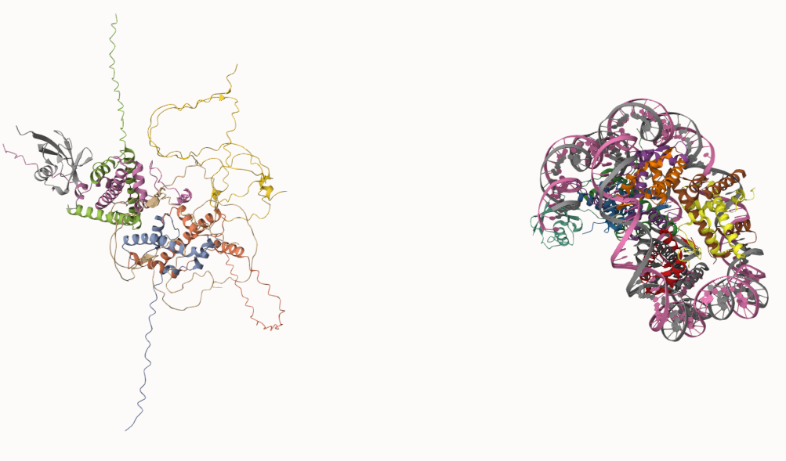

# Local Colabfold Guide for Lin Lab

Colabfold is used to predict the sturcture of your designed protein sequence.

Source: https://github.com/YoshitakaMo/localcolabfold

- [Local Colabfold Guide for Lin Lab](#local-colabfold-guide-for-lin-lab)
  - [Usage](#usage)
    - [input](#input)
  - [Input Specification](#input-specification)
    - [How to use CSV](#how-to-use-csv)
    - [How to Input Multi Subunit](#how-to-input-multi-subunit)
  - [How to update](#how-to-update)
  - [Demos](#demos)
    - [Demo1: multiple FASTA files](#demo1-multiple-fasta-files)
    - [Demo2: run for multimer as a single file](#demo2-run-for-multimer-as-a-single-file)


## Usage

For first-time use in a new account, you must ensure it's added to PATH, by adding a line in `~/.bashrc`:
```bash
export PATH="/opt/localcolabfold/colabfold-conda/bin:$PATH"
```

```bash
$ colabfold_batch <input> <output directory>
```

* option for templates: `--templates`
* option for relaxation: `--amber`

### input

One of:
* directory of fasta/a3m files
* a csv/tsv file (i.e. a table with each line as a sequence)
* a fasta/a3m file

## Input Specification

### How to use CSV

**id**,**sequence**  
5AWL_1,YYDPETGTWY  
3G5O_A_3G5O_B,MRILPISTIKGKLNEFVDAVSSTQDQITITKNGAPAAVLVGADEWESLQETLYWLAQPGIRESIAEADADIASGRTYGEDEIRAEFGVPRRPH:MPYTVRFTTTARRDLHKLPPRILAAVVEFAFGDLSREPLRVGKPLRRELAGTFSARRGTYRLLYRIDDEHTTVVILRVDHRADIYRR

### How to Input Multi Subunit

For prediction of multimers, insert : between the protein sequences (in FASTA).

```
>1BJP_homohexamer
PIAQIHILEGRSDEQKETLIREVSEAISRSLDAPLTSVRVIITEMAKGHFGIGGELASKVRR:
PIAQIHILEGRSDEQKETLIREVSEAISRSLDAPLTSVRVIITEMAKGHFGIGGELASKVRR:
PIAQIHILEGRSDEQKETLIREVSEAISRSLDAPLTSVRVIITEMAKGHFGIGGELASKVRR:
PIAQIHILEGRSDEQKETLIREVSEAISRSLDAPLTSVRVIITEMAKGHFGIGGELASKVRR:
PIAQIHILEGRSDEQKETLIREVSEAISRSLDAPLTSVRVIITEMAKGHFGIGGELASKVRR:
PIAQIHILEGRSDEQKETLIREVSEAISRSLDAPLTSVRVIITEMAKGHFGIGGELASKVRR
```

## How to update

In colabfold_batch directory, simply run:

```bash
# set your OS. Select one of the following variables {linux,intelmac,M1mac}
$ OS=linux # if Linux
# get the latest updater
$ wget https://raw.githubusercontent.com/YoshitakaMo/localcolabfold/main/update_${OS}.sh -O update_${OS}.sh
$ chmod +x update_${OS}.sh
# execute it.
$ ./update_${OS}.sh .
```

## Demos

### Demo1: multiple FASTA files

We downloaded mulitple FASTA files from PDB with pdb file to validate their configuration.

Command:

```bash
$ colabfold_batch ./input ./output
```

The results are all contained in the output folder, and can be differentiated by their prefixes. The main results are the pdb files.

The only problem is for multimers they will be seperated into different pdb files.

### Demo2: run for multimer as a single file

Let's copy protein 8V26 and modify the FASTA so it looks like a single sequence seperated by `:`. Run:

```bash
$ colabfold_batch ./8V26_modified.fasta ./
```

In the meantime, you'll see clearly what results will be generated for a single instance.

*The assembly can be quite slow.



In this demo, chains of 5 sequences in different colors are assembled (left), in comparison with the true structure (right, ignore the DNA sequence). The program will try 5 models for different configurations, each of which can take hours.

You can see they are unmatched. It's probably because the model won't consider the DNA strangled around.